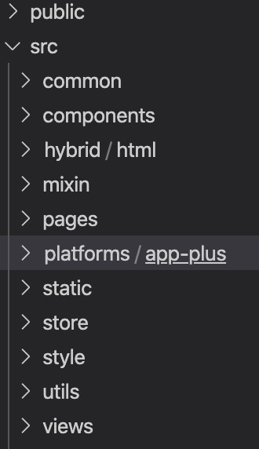
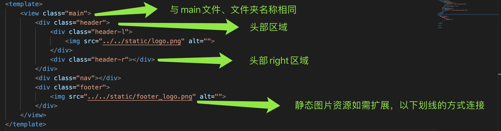

# 前端开发文档规范

#### 一、项目名称

项目命名以 ***公司简称*** + ***短横线*** + ***项目名称*** 来命名，如：hc-exam（弘成-考试项目）

如需增加管理端、h5端、小程序端、app端则以相对应的后缀结尾。如：hc-exam-admin、hc-exam-h5、hc-exam-applet、hc-exam-app。

_注意：禁止使用大些字母，禁止驼峰_

#### 二、项目子文件夹名称

views、screens、pages 子文件夹统一采用 ***小写英文*** 单词命名，如需增加扩展，通过短横线链接的方式，如：auth-basic

components 子文件夹统一采用 ***首字母大写*** 的驼峰命名方式，如：SvgIcon、TableView

如下图所示：

#### 三、项目子文件名称

##### 1、react.js / React Native 项目中文件命名原则：

screen、components等文件夹下文件命名 ***必须*** 采用 ***首字母大写*** 的方式，如：User.js、LoginScreen.jsx

其余文件如index.js、locations.js、imgs.js、history.js尽量采用首字母小写，不做严格限制。

##### 2、vue.js 类项目中文件命名原则：

views、screens、pages文件以 ***英文小写单词*** 命名，如index.js、login.vue、user.js。

components文件采用 ***首字母大写*** 的驼峰命名方式，如：NavBar.vue、TableView.vue。

#### 四、文件class以及静态图片命名规范

页面父级view、div的class以文件名称来命名；
页面每一个区域根据区域位置区分；
页面每一个区域的每一部分的class采用短横线 加 l、r、t、b、c、f 的方式；

_注意：禁止使用大些字母命名，禁止驼峰命名_

如下图所示：

#### 五、Function命名规范

以小写英文单词 / 驼峰 进行命名，如：login()、handleSubmit()。
